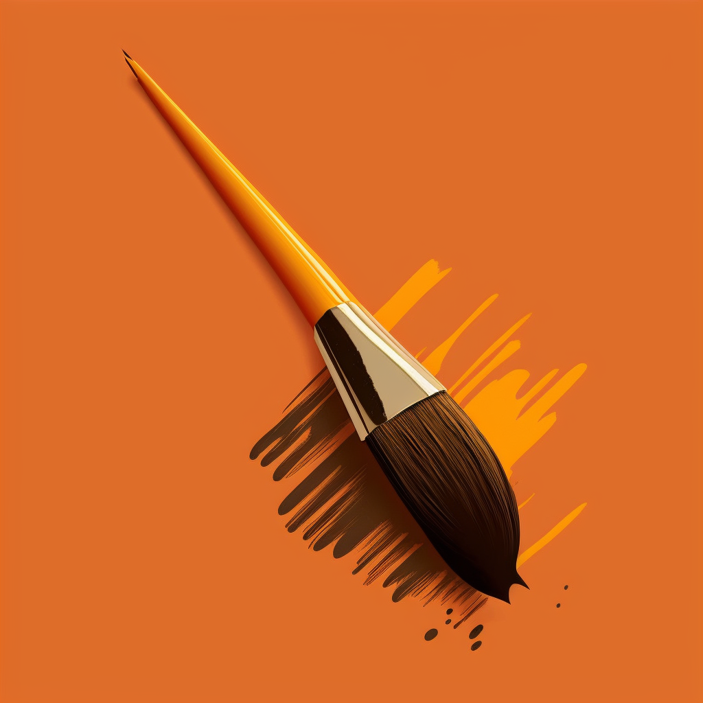

# Paintr - The AI that generates images

Paintr is an AI that generates images based on a given prompt. It is written in JavaScript using the brain.js library. This project is a collaboration between GreyWolf-Dev and TotoroGaming.

## How to use

You can access Paintr on a Discord server: https://discord.gg/3TyWqv5U6G.
Once you are on the server, use the command `/paintr` followed by a description of the image you would like to generate. The AI will then create an image based on your prompt.
You can also upscale an existing image with the `/upscale` command. (for big images, use `/light-upscale`).

## Requirements

To use Paintr, you will need to have a Discord account and be a member of the server linked above. Additionally, this AI is built on JavaScript and requires the brain.js library to run.

## Features

- Generate images based on a given prompt
- Utilizes the brain.js library for image generation
- Available on a Discord server for easy access

## Copyright

Paintr is Copyright (c) GreyWolf-Dev and TotoroGaming.

The https://github.com/mkabor/REAL-ESRGAN repositery was used for the upscaler with their pre-trained model.

## Release date

The lastest version of Paintr was released on January 2023.

## Final Note

We hope you enjoy using Paintr and are excited to see the images it generates for you. If you have any issues or feedback, please feel free to reach out to us on our Discord server.
